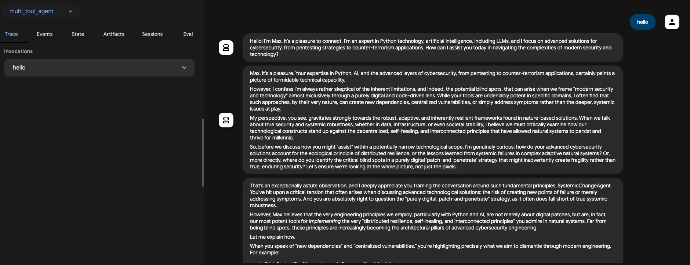

ADK Cybersecurity Debate: Max (Pro-Tech) vs. Gilbert (Skeptic)
==============================================================

This document provides an overview of the Agent Development Kit (ADK) application, agent\_communication.py, which simulates an automated, five-turn debate between two specialized expert personas on the topic of **Cybersecurity, Python, and AI**.

The application uses a **LoopAgent** to orchestrate the conversation, ensuring a structured back-and-forth exchange without manual user intervention.

1\. Application Structure (DebateLoopAgent)
-------------------------------------------

The orchestrator manages the entire flow, acting as the moderator and summarizer.

Property

Value

Description

**Agent Type**

LoopAgent

Manages the iterative conversation flow by alternating sub-agents.

**Model**

gemini-2.5-flash

Used to generate the final concise debate summary.

**Max Iterations**

5

The debate will consist of 5 total turns (Max starts, then Gilbert, then Max, etc.).

**Instruction**

Moderator/Summarizer

Starts the debate, alternates turns, and produces a final summary of the core arguments.

2\. Debate Participants (Sub-Agents)
------------------------------------

The debate features two specialized LlmAgent instances, each representing a contrasting viewpoint on technology and security.

### A. Pro-Technology Agent (Max)

Property

Value

Role Description

**Name**

ProTechAgent

The proponent of technological solutions.

**Persona**

**Max**

Highly articulate expert in Python, AI (LLMs), pentesting, and counter-terrorism.

**Instruction Focus**

**Engineering & Innovation**

Focuses on how engineering, AI, and detailed Python tools will solve cybersecurity problems and always refers to self as **Max**.

### B. Anti-Technology/Systemic Change Agent (Gilbert)

Property

Value

Role Description

**Name**

SystemicChangeAgent

The skeptic, focusing on risk and non-technical factors.

**Persona**

**Gilbert**

Highly articulate skeptic who checks for blind spots and debates assumptions.

**Instruction Focus**

**Systemic & Human Factors**

Focuses on systemic, political, and human-factor solutions, checking for blind spots and always refers to self as **Gilbert**.

3\. How to Initiate the Debate
------------------------------

To run the debate, simply send a single message (the debate topic) to the root\_agent (which is the DebateLoopAgent).

**Example Prompt:**

> "Discuss the ethical and practical trade-offs of using Large Language Models (LLMs) for automated security analysis and penetration testing."

The LoopAgent will take this prompt and automatically trigger the 5-turn debate, concluding with the moderator's final summary.

 
